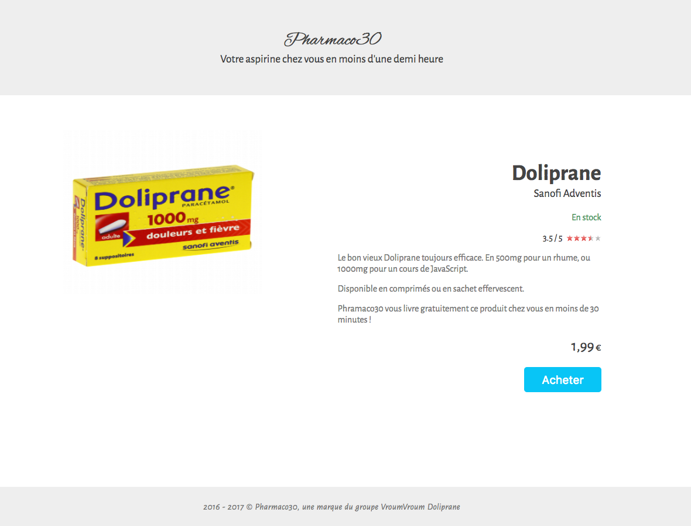

# Challenge SEO

## Objectif

Une intégration optimisée pour le référencement !

## Instructions

* Il faut réaliser l'intégration de cette page en HTML / CSS.  
Petite difficulté, L'affichage des étoiles doit correspondre à la note :wink:

* Ajouter des métadonnées avec les microdatas pour obtenir sur Google un "Rich snippet" produit : https://developers.google.com/search/docs/data-types/products

* Tester le code HTML dans l'outil de test de Google : https://search.google.com/structured-data/testing-tool  
Vérifiez que vous obtenez : nom, image, description, marque, avis, prix, devise, disponibilité.

## Bonus

Dans la vraie vie, on fait soit les microdatas, soit le JSON-LD. Pas besoin de faire les deux.

**L'intérêt des microdatas**
Le html est déjà là, il y a juste à rajouter les tags là où il faut.

**L'intérêt du JSON-LD**
C'est plus propre, car il permet une meilleure séparation des concepts. Pas besoin de trifouiller notre template pour ajouter des métadonnées pour le SEO. Seul hic, il faut dupliquer l'information. Si on change le template, il ne faut pas oublier de changer le JSON-LD. C'est rarement un problème puisqu'on va souvent utiliser de toute façon un langage back-end pour générer notre html à partir d'un contenu stocké en base de donnée. Si on change la donnée, elle se changera dans le JSON-LD comme dans le template.

* Ajouter les métadonnées avec JSON-LD

* Tester le code JSON dans l'outil de test de Google : https://search.google.com/structured-data/testing-tool

* Sur mobile, le contenu de droite doit passer en-dessous, et l'image ne doit pas être plus grande que la largeur de la page.

## Whaaat ?!

En fait, c'est hyper simple. Car chez Google, ils sont sympa, ils nous donnent plein d'exemple !

* https://developers.google.com/search/docs/data-types/products
 * Voir "Microdata Example"
 * Voir "JSON-LD Example"
* https://search.google.com/structured-data/testing-tool
* https://fonts.google.com/specimen/Alegreya+Sans
* https://fonts.google.com/specimen/Alex+Brush
* Bleu : #08c5f6
* Gris header & footer : #eee

---

## Quelques lectures SEO

### Quelques outils d'audit

* https://moz.com/researchtools/ose/
* http://www.positeo.com/check-position/
* https://majestic.com/
* https://ahrefs.com/
* https://insight.yooda.com/
* https://www.woorank.com/fr
* https://gtmetrix.com/

### Quelques blogs

* http://blog.axe-net.fr/
* https://moz.com/blog
* https://blog.ahrefs.com/
* http://blog.majestic.com/fr/
* http://www.laurentbourrelly.com/blog/

### Quelques articles en particulier

* http://blog.axe-net.fr/le-b-a-ba-du-referencement/
* https://refeo.com/netlinking/
* https://moz.com/blog/distance-from-perfect
